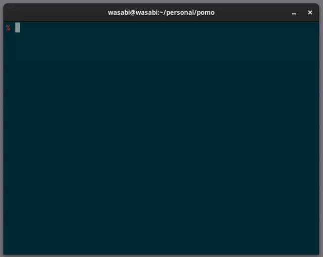

# Pomo

A TUI pomodoro that helps you focus more and prevent burnouts.



## Motivation

Most of the time I like to have control of my apps through the terminal and I recently started using the [Pomodoro Technique](https://www.pomodorotechnique.com/).

I found out that I had to use my phone to set timers or my watch to set stopwatches. I don't like to use my phone for this because i end up checking stuff i shouldn't while working. I don't like to use stopwatches either because I always forget to stop them on time.

I wanted something that only worked from my computer, in order to condition myself so computer = work = focus.

There are plenty of these TUI's out there like
- [charlieroth/pomotui](https://github.com/charlieroth/pomotui)
- [c0nradLC/homodoro](https://github.com/c0nradLC/homodoro)
- [And many others](https://www.google.com/search?q=pomodoro+tui&oq=pomodoro+tui&gs_lcrp=EgZjaHJvbWUqBggAEEUYOzIGCAAQRRg7MgYIARBFGD0yBggCEEUYPDIGCAMQRRg90gEIMzIwNGowajGoAgCwAgA&sourceid=chrome&ie=UTF-8)

I just wanted to build my own implementation.

## Get started

### Method 2: Local
1. Clone this repository
```bash
git clone https://github.com/waldo2810/pomo.git
```
2. Build binary
```bash
make
```
3. Run Pomo binary
```bash
./pomo
```
